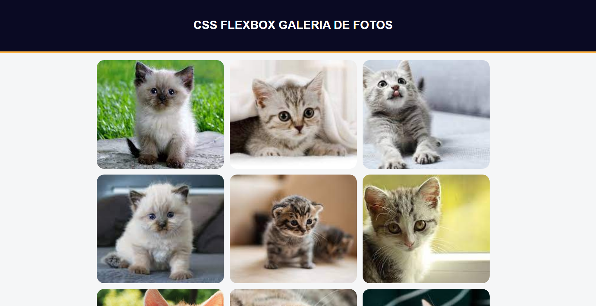

# GALERIA DE FOTOS

Um parágrafo da descrição do projeto vai aqui

## 🚀 Começando

Essas instruções permitirão que você obtenha uma cópia do projeto em operação na sua máquina local para fins de desenvolvimento e teste.

### ⌨️ Tela

## 📦 website

<a href="https://roberio015.github.io/galeria_fotos/">https://roberio015.github.io/galeria_fotos/</a>

Adicione notas adicionais sobre como implantar isso em um sistema ativo

## 🛠️ Tecnologias e ferramentas usadas usadas

Mencione as ferramentas que você usou para criar seu projeto

* [HTML](http://www.dropwizard.io/1.0.2/docs/) - Linguagem de Marcação de Hiper texto.
* [CSS](https://maven.apache.org/) - Estilização
* [Visual Studio Code](https://code.visualstudio.com/) - Usada para gerar RSS

## 🖇️ Repositorio

https://github.com/Roberio015/galeria_fotos.git

## ✒️ Autor

Mencione todos aqueles que ajudaram a levantar o projeto desde o seu início

* **Um desenvolvedor** - *Trabalho Inicial* - [umdesenvolvedor](https://github.com/Roberio015)
